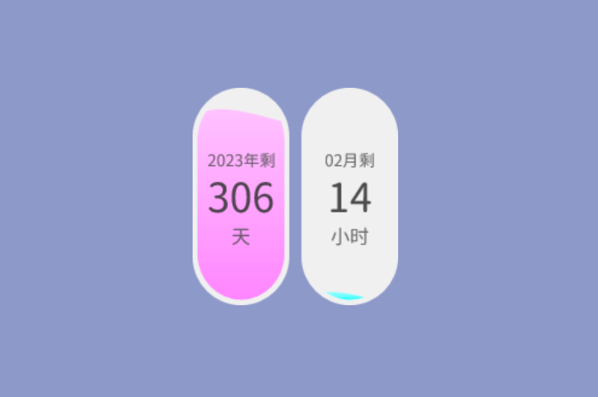
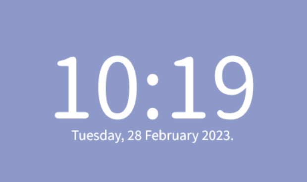

# JinsWidgets

自制的[Rainmeter](https://www.rainmeter.net/)小部件

## 1. CountDownTime（倒计时）

一个年、月倒计时组件。

- 支持闰年；
- 倒计时填充颜色支持修改，目前使用渐变色。
- 倒计时尺寸支持修改；
- 倒计时圆弧角度支持修改；
- 倒计时支持进度颜色像水波纹一样晃动（目前代码注释掉了，未开启）。

todo

- [ ] 倒计时进度颜色像水波纹一样晃动联动声音，有声音的时候就动。

## 2. Time

一个简约时钟。

